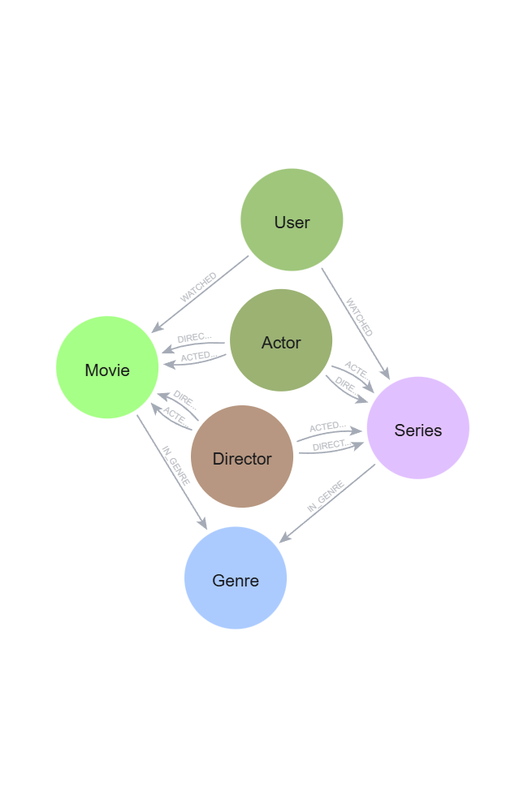
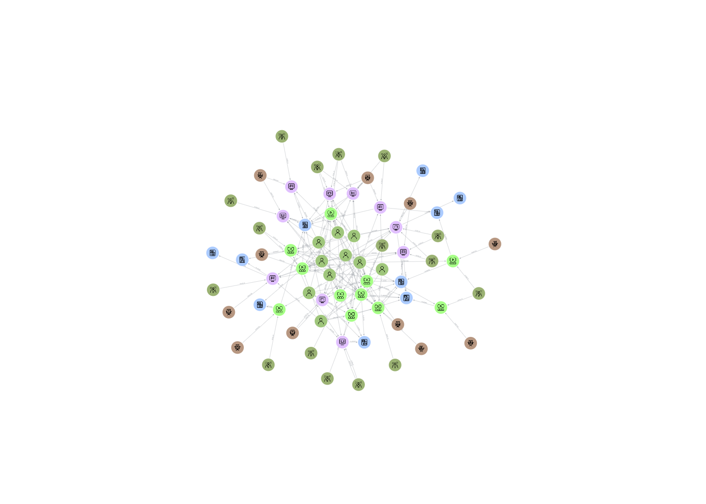

# dio-neo4j-lab-project
Implementing and documenting a project of streaming graph database using Neo4J Aura.

## Planning and structuring:

For the initial planning and creation of a sketch of the graph, Arrows.app was used. The nodes and its relationships were mostly designed and linked there. However, since the export is in JSON not in Cypher, it made me take a good look in methods to import the data into Neo4J Aura. Most of the mentioned methods are not actually available in Aura, so after trying to convert the JSON to CSV a few times to import directly without success, I ended up using LLMs assistance to bulk create the Cypher queries and recreate the graph in Neo4J Aura, because doing it manually would be quite time consuming.

## Recreating the Graph Database in Neo4J Aura:

After having the queries prepared, recreating the planned graph was pretty straightforward. Only a few small adjustments were made to improve visualisation, and fixed 2 relationships that were created but I missed adding description to them.

## Describing the process:

Attached in this repository, the images and also copies of queries, graph and its structure are available for consultation on the folder Sources, which is essentially an archive. Most of it looks simple because all the sketching and structuring provided a good base to create the graph.

Using the graph, it is possible to determine what are the most watched shows, the preferred genre of an audience, doing profiling, analysing the range of work of actors and directors, among many other possibilities, even though this is a small dataset.

